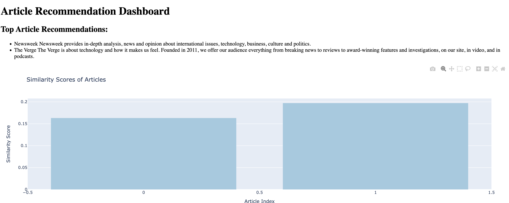

<h1 align="center">Article Recommendation Dashboard</h1>

<p align="center">
    
</p>

<p align="center">
    <em>A simple article recommendation system with an interactive dashboard.</em>
</p>

---

## Features

- Fetches news articles from the NewsAPI based on a given topic
- Performs data preprocessing using NLTK
- Calculates TF-IDF scores for the articles
- Recommends top articles based on user input
- Generates a dashboard using Plotly and Dash to visualize the recommendations


## Getting Started

### Prerequisites

- Python 3.x
- pip package manager

### Installation

1. Clone the repository:
```bash
https://github.com/savrgg/kaggle_experiments.git
```

2. Navigate to the project directory:
```bash
cd article-recommendation-dashboard
```


3. Install the required dependencies:
```bash
pip install -r requirements.txt
```


### Usage

1. Obtain an API key from [NewsAPI](https://newsapi.org/) and replace `<API_KEY>` with your actual API key in `config.json`.

2. Run the main script to start the article recommendation dashboard:
```bash
python main.py
```


3. Open your browser and visit `http://localhost:8050` to access the dashboard.

4. Enter a topic of interest and click "Submit" to see the top article recommendations.

## Architecture

The project follows a modular architecture with the following components:

- **news_api.py**: Handles communication with the NewsAPI to fetch news articles.
- **text_processor.py**: Provides text preprocessing functionality using NLTK.
- **tfidf.py**: Calculates the TF-IDF scores for the articles using scikit-learn.
- **dashboard.py**: Defines the ArticleDashboard class to generate the recommendation dashboard.
- **main.py**: Entry point of the program, fetches articles, performs calculations, and creates the dashboard.

## License

This project is licensed under the MIT License. See the [LICENSE](LICENSE) file for details.

## Acknowledgements

- [NewsAPI](https://newsapi.org/) - News articles API
- [NLTK](https://www.nltk.org/) - Natural Language Toolkit
- [scikit-learn](https://scikit-learn.org/) - Machine Learning library
- [Plotly](https://plotly.com/) - Interactive plotting library
- [Dash](https://dash.plotly.com/) - Framework for building analytical web applications

## Contributing

Contributions are welcome! If you find any issues or have suggestions for improvement, please feel free to open an issue or submit a pull request.


